**DOCUMENT HISTORY**

| Version | Date     | Name           | Version purpose | Status |
|---------|----------|----------------|-----------------|--------|
| 1.0     | 27/08/26 | Girish Luckhun | Initial version | W      |
| 1.1     | 00/00/00 |                |                 |        |

Status: **W** = Writing in progress, **C** = for Comment, **A** = for **A**pproval, **V** = Validated, **O** = Obsolete

# Table of Contents

- [Table of Contents](#table-of-contents)
- [Introduction](#introduction)
- [Server Setup](#server-setup)
  - [Initial Environment State](#initial-environment-state)
  - [Target Server Failure](#target-server-failure)
- [Recovery Procedures](#recovery-procedures)
  - [Automated Repair via AWS EC2Rescue](#automated-repair-via-aws-ec2rescue)
  - [Manual Offline Repair via DISM \& SFC (CLI)](#manual-offline-repair-via-dism--sfc-cli)
    - [Volume mount on Server\_B](#volume-mount-on-server_b)
    - [Inspect Update Health](#inspect-update-health)
    - [Repair System Image Store (DISM)](#repair-system-image-store-dism)
    - [Repair System Binaries (SFC Scan)](#repair-system-binaries-sfc-scan)
    - [Dismount \& Volume Reattachment](#dismount--volume-reattachment)
  - [Rebuild a New Instance](#rebuild-a-new-instance)
    - [Detach Data Volumes from the Failed Instance](#detach-data-volumes-from-the-failed-instance)
    - [Launch New Instance](#launch-new-instance)
    - [Attach Data Volumes](#attach-data-volumes)
    - [Mount Disks \& Verify](#mount-disks--verify)
    - [Reconfigure Active Directory](#reconfigure-active-directory)
- [References](#references)

# Introduction

This document explains how to recover a corrupted EC2 instances (Windows) when remote access(RDP, SSH or SSM) is unavailable due to boot or os failure.

# Server Setup 

## Initial Environment State

Two functioning EC2 instances are provisioned in the same Availability Zone:

- **Server_A:** Target Server (The instance to be corrupted)

- **Server_B:** Helper/Rescue Server (The healthy instance used for offline repair)

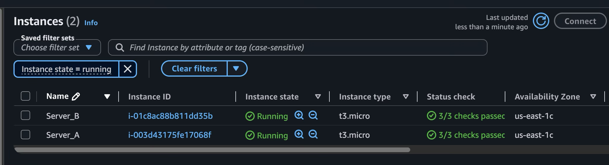

## Target Server Failure

Intentionally corrupt the boot path configuration on **Server_A** so that the Instance Status Check as **2/3 checks passed.**

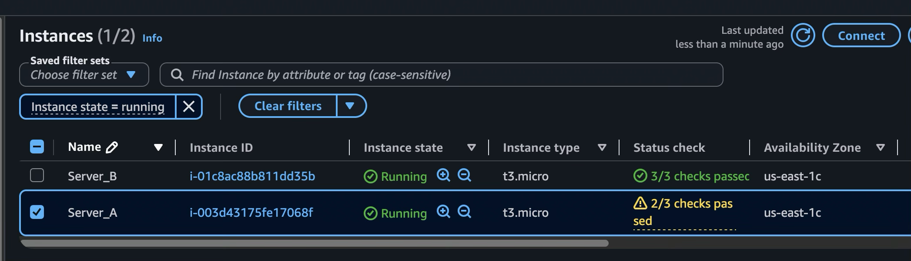

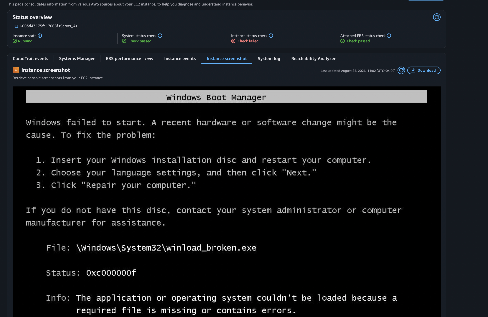

# Recovery Procedures

## Automated Repair via AWS EC2Rescue

**EC2Rescue for Windows** is an official AWS utility designed to diagnose and repair boot, registry, and driver issues on offline EC2 volumes.

The file can be downloaded here : <u>https://s3.amazonaws.com/ec2rescue/windows/EC2Rescue_latest.zip?x-download-source=docs</u>

1.  Target Volume

    In the AWS EC2 Console, select **Server_A** and click **Instance State \> Stop instance** (Force stop if shutdown hangs).

    Navigate to **Volumes**, select the root volume (/dev/sda1 or /dev/xvda), and click **Actions \> Detach volume**.

    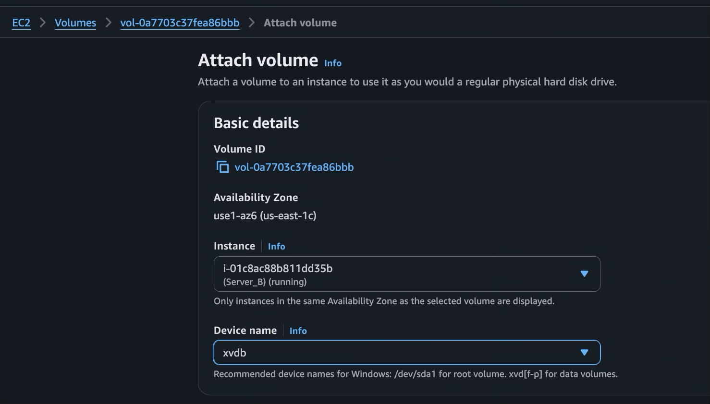

2.  Mount Volume to Helper Instance:

    Attach the volume to **Server_B** as a secondary disk

3.  Bring Disk Online:

    Connect to **Server_B** via RDP

    Open **Disk Management** (diskmgmt.msc), locate the newly attached disk, right-click, and select **Online**.

    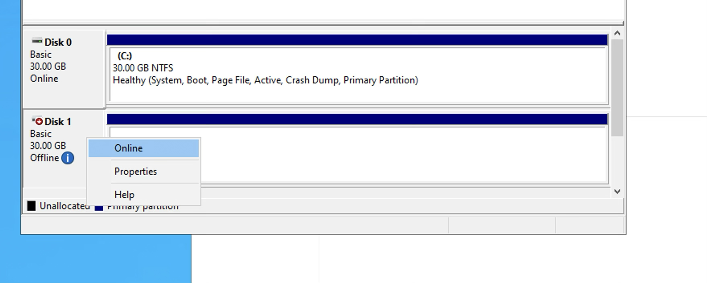

Once mounted, note the assigned drive letter (typically D:):

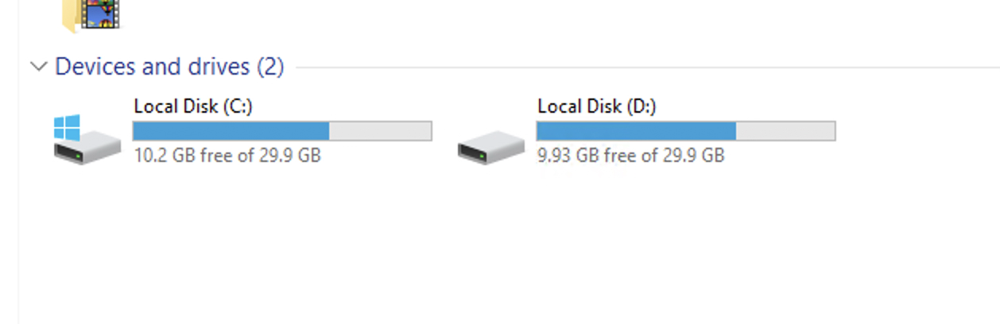

4.  Execute EC2Rescue Diagnostics:

    Download the [EC2Rescue for Windows](https://s3.amazonaws.com/ec2rescue/windows/EC2Rescue_latest.zip?x-download-source=docs) package on **Server_B** by pasting the link in a browser.

    Extract the ZIP package and launch EC2Rescue.exe

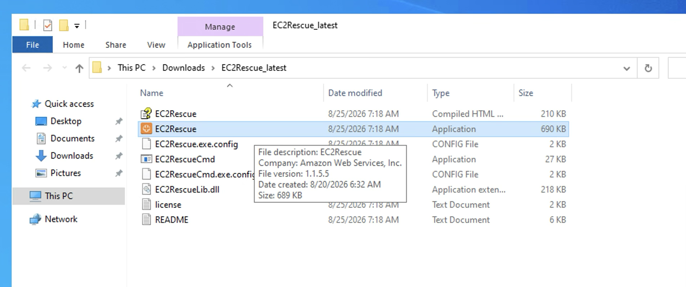

Select **Offline Instance** as the operational mode.

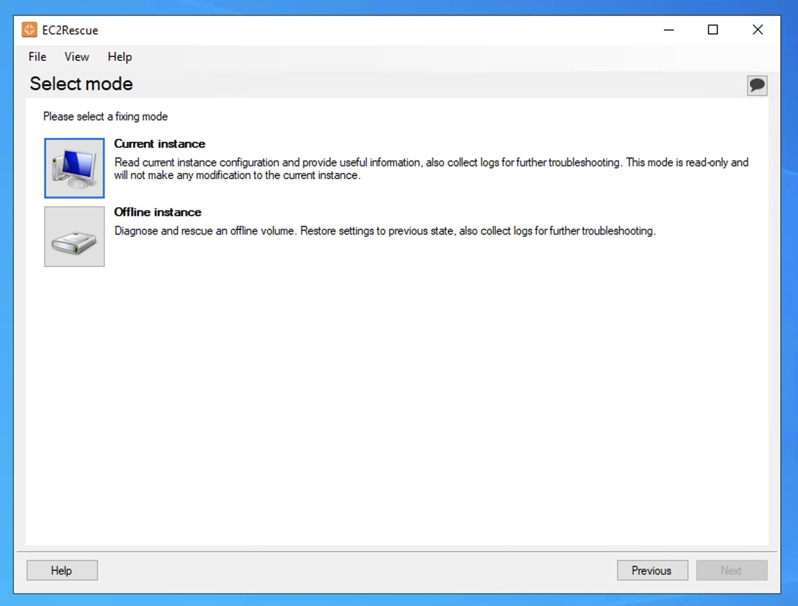

EC2Rescue will automatically detects target volume D:

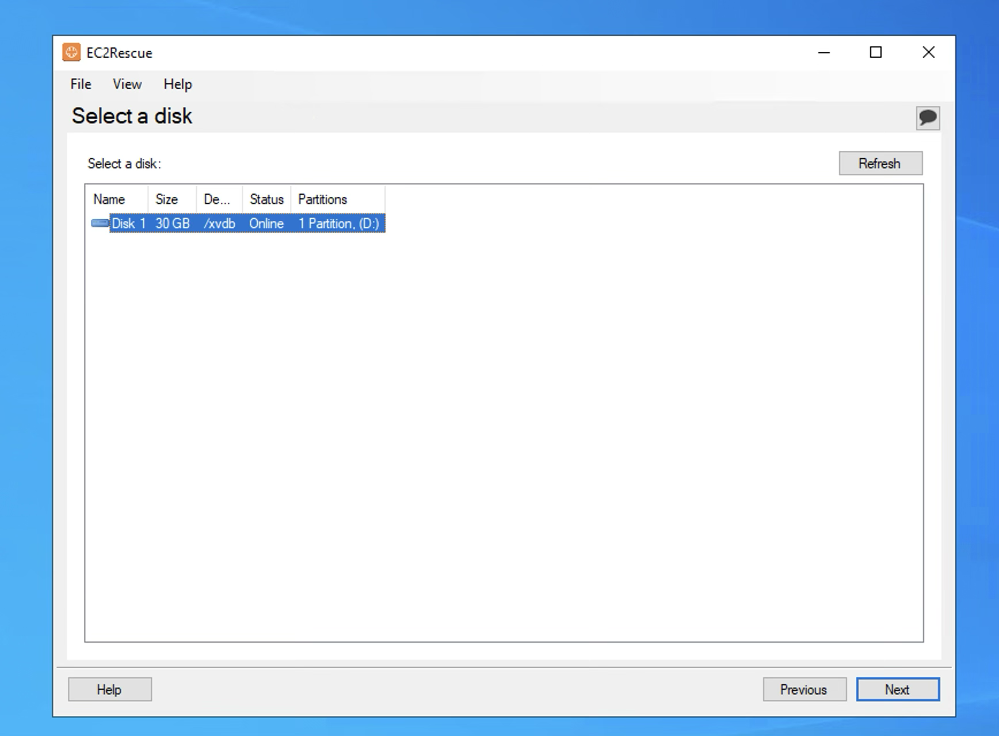

Click **Diagnose and Rescue**.

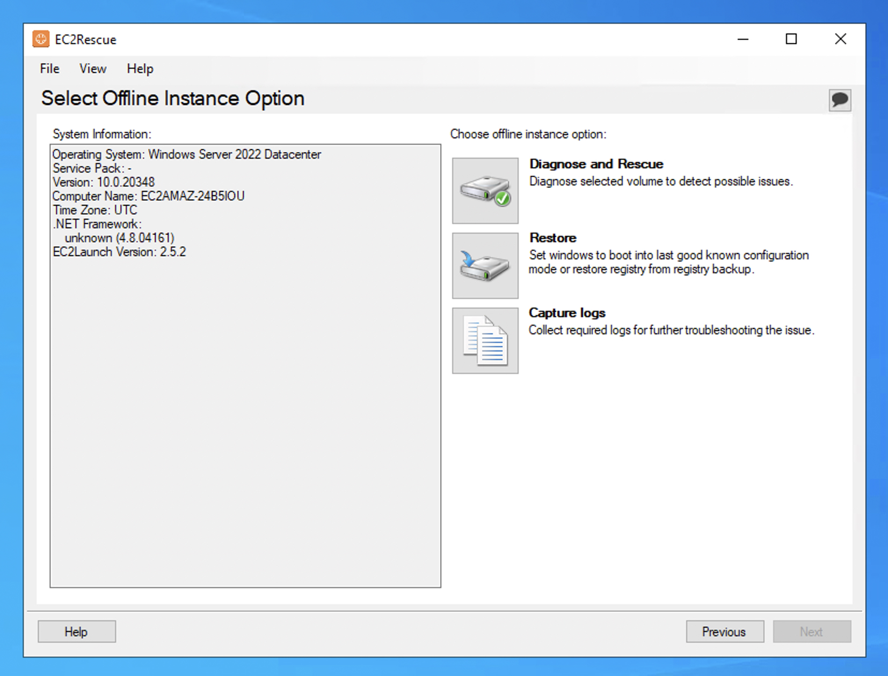

Select **Fix Boot Issues** and **Restore Registry from Last Known Good Configuration**, then click **Next** to apply repairs.

5.  Dismount & Re-attach Volume:

    Open **Disk Management** on **Server_B**, right-click drive D:, and set it back to **Offline**.

    In the AWS Console, **Detach** the volume from **Server_B**.

    **Re-attach** the volume back to **Server_A**.

    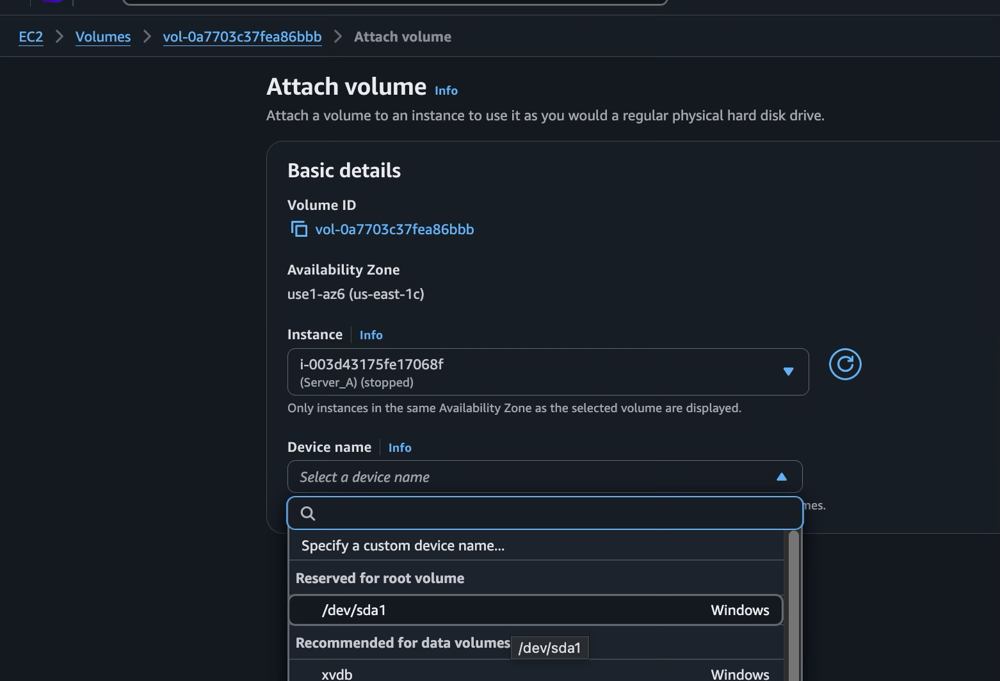

Ensure the device name is set to the original root block device path (/dev/sda1 or /dev/xvda).

6.  Start the Server_A and check if the server has gone back to normal.

## Manual Offline Repair via DISM & SFC (CLI)

If AWS EC2Rescue fails to resolve the corrupt disk, perform manual command-line using **DISM** and **SFC** on **Server_B** while target volume D: is attached and online.

### Volume mount on Server_B

7.  Stop Server_A:

8.  Detach Root Volume:

9.  Attach to Helper Instance:

10. Bring Volume Online:

### Inspect Update Health

Check for broken updates or servicing operations stuck mid-installation:

// 1. List installed updates to identify failed or pending states

DISM /Image:D:\\ /Get-Packages

 

// 2. Revert pending updates causing boot loops

DISM /Image:D:\\ /Cleanup-Image /RevertPendingActions

 

### Repair System Image Store (DISM)

Scan and repair the offline Windows Component Store

DISM /Image:D:\\ /Cleanup-Image /RestoreHealth

### Repair System Binaries (SFC Scan)

Once DISM confirms component store integrity, run an offline System File Checker scan to restore missing or corrupted OS binaries:

sfc /SCANNOW /OFFBOOTDIR=D:\\ /OFFWINDIR=D:\windows

### Dismount & Volume Reattachment

1.  Open **Disk Management** on **Server_B**, right-click drive D:, and set the disk to **Offline**.

2.  In the AWS Console, **Detach** the volume from **Server_B**.

3.  **Re-attach** the volume back to **Server_A** as the root block device (/dev/sda1 or /dev/xvda).

4.  Start **Server_A** and confirm **Instance Status Checks** report 2/2 (or 3/3) checks passed.

## Rebuild a New Instance

In a worst-case scenario where os repair fails completely, provision a new cleaninstance and swap in the original data volumes.

### Detach Data Volumes from the Failed Instance

2.  Stop Server_A: In the AWS EC2 Console, select Server_A and click Instance State \> Stop instance.

3.  Detach Volumes: Go to Volumes, select all secondary data volumes attached to Server_A

### Launch New Instance

1.  Launch a fresh EC2 instance with a clean OS using the same settings (AMI, Subnet, Security Groups).

### Attach Data Volumes

1.  Go to **Volumes**, select each original **Data Volume**, and click **Actions \> Attach volume**.

2.  Choose **Server_A_Rebuilt** and assign the corresponding device paths

### Mount Disks & Verify

1.  Connect to **Server_A_Rebuilt** via RDP

2.  Open **Disk Management** (diskmgmt.msc), set the data disks to **Online**, and verify drive letters and application data are accessible.

### Reconfigure Active Directory

If the rebuilt server was previously joined to Active Directory and domain access is lost, perform the necessary actions to reestablish the domain trust connection.

# References

<https://s3.amazonaws.com/ec2rescue/windows/EC2Rescue_latest.zip?x-download-source=docs>

<https://docs.aws.amazon.com/AWSEC2/latest/UserGuide/ics-common.html#getting-ready-screen>
